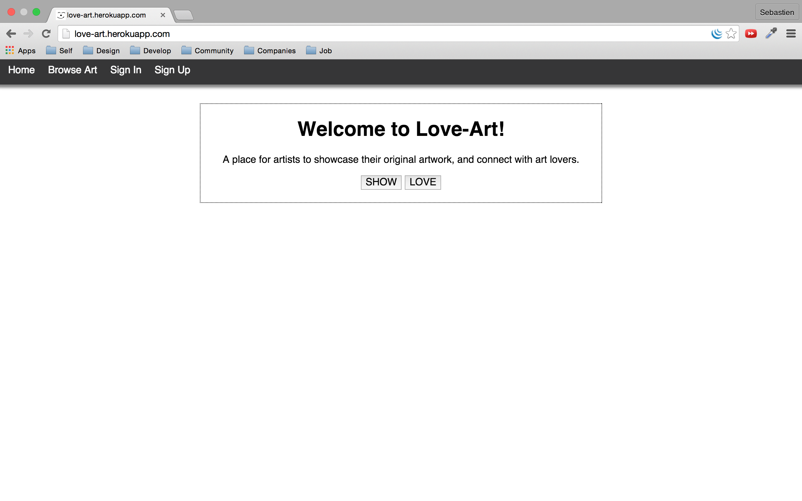
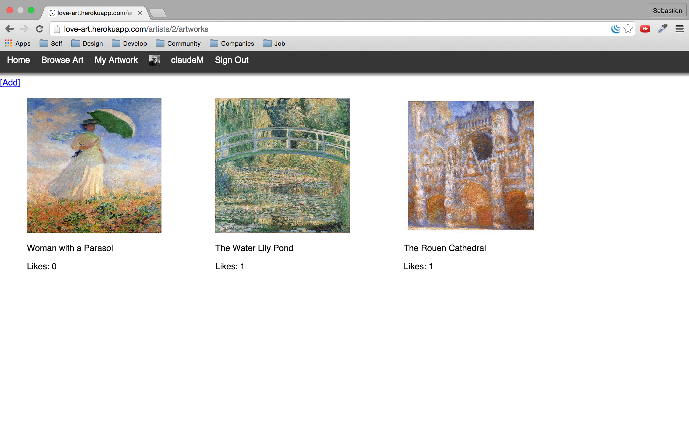
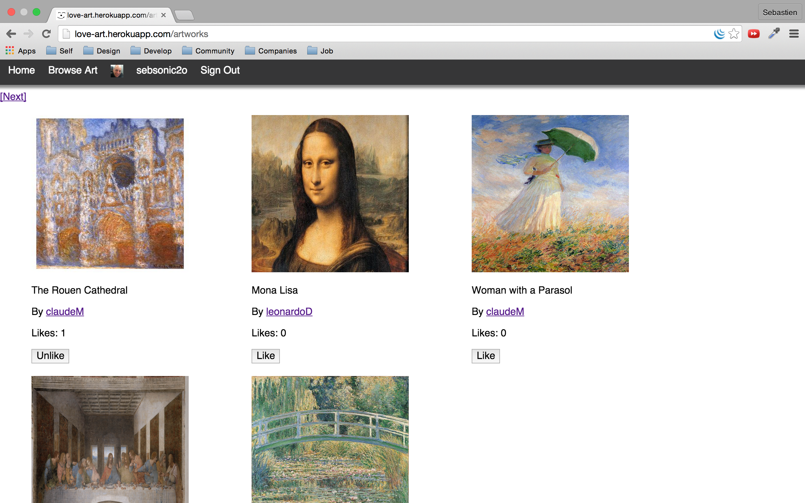
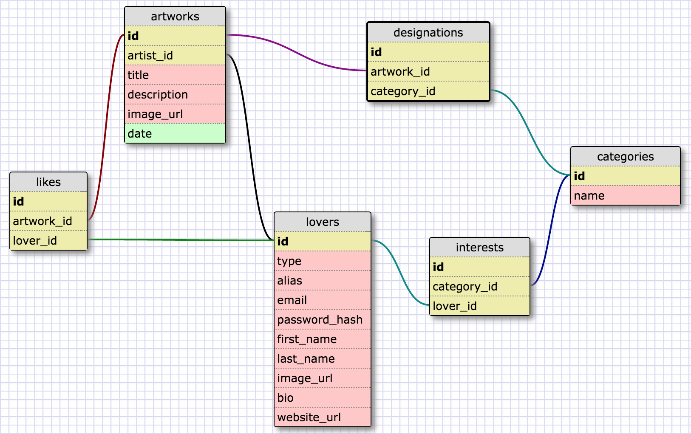

# Love Art

Love Art is a place for artists to showcase their original artwork, and connect with art lovers.

Written in Ruby, it is a Sinatra application with a MVC skeleton and RESTful routes. It also includes some JavaScript (jQuery and AJAX). Object-Relational Mapping leverages ActiveRecord along with single-table inheritance techniques.

This proof-of-concept was completed in four days as part of a personal side project, and is deployed [here](http://love-art.herokuapp.com) on Heroku.

## Show

An artist signs in, or signs up to add his artwork.

## Love

A user can browse artwork, and shows his love after signing in or signing up.

## PostgreSQL Schema

